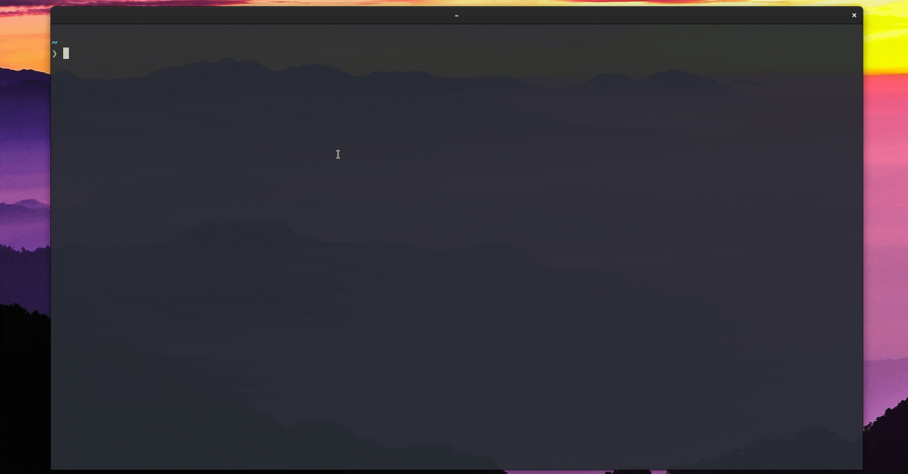

<p align="center">

</p>

# Treq


#### TReq is a extremelly tiny and fast Http/API Rest Client in Terminal. It's inspired in softwares like [Insominia](https://insomnia.rest/download), [Postman](https://www.postman.com/) and [Neovim](https://github.com/neovim/neovim)
### 
#### It integrates with your favorite text editor, letting you edit the body of request as you prefer and get quickly the response. 

<br />



# Instalation

### Recommended

For any linux environment is possible to download TReq by [Crates.io](https://crates.io/crates/treq) repository. Using this method requires to have [Rust](https://www.rust-lang.org/pt-BR/tools/install) installed. 

After install Rust just run:

```sh
cargo install treq
```

Due to fact it will compile and build TReq, this can to take a while.

### Debian, Ubuntu, Linux Mint, PopOS, Zorin
It's possible to download TReq using the [.deb file](https://github.com/talis-fb/TReq/releases).

After download it by link [HERE](https://github.com/talis-fb/TReq/releases) you can just run the command below pointing to file.
```sh
$ sudo dpkg -i path_to_file.deb
```

### Arch Linux, Manjaro
TReq is available in [AUR](https://aur.archlinux.org/packages/treq-bin/) Repository.

```sh
$ git clone https://aur.archlinux.org/treq-bin.git
$ cd treq
$ makepkg -si
```

Or, if you use the [yay](https://github.com/Jguer/yay) just run...

```sh
$ yay -S treq-bin
```

# Setup

To use TReq is necessary setup the `EDITOR` env variable. It'll use this configuration to open the Text Editor.

TReq doesn't have a way to edit a Body of Requests. It delegates this work to a Text Editor of your choice. The. It's recommend use a Terminal Text Edtiro like 'vim', 'neovim', 'nano' or even 'emacs'.

You can set up the EDITOR env variable in a terminal session using this command below. However, after you close the terminal session (window) this configuration'll be dropped.
```sh
export EDITOR=vim # instead vim you can use 'code', 'nano', 'emacs', etc..
```

To set this up permanent it's necessary puts this in your shell configuration.
```sh
# to bash users
echo 'export EDITOR=vim' >> ~/.bashrc 

# to zsh users
echo 'export EDITOR=vim' >> ~/.zshrc

# to fish users
echo 'export EDITOR=vim' >> ~/.config/fish/config.fish 
```

Normally, some Linux Systems already have this set up. Using some basic Unix Text Editor like _vi_ or _nano_.

It's great use some terminal editor, like Vim or Emacs to have a smooth experience. Since you'll can open them in same terminal session of TReq.

However, it's totally fine use some Graphical editor like VS Code or Atom. In these cases, when you hit the command to edit body TReq will open it up and then you'll need to hit 'r' to reload the content of file in TReq ever time you make some change. Since, TReq gets the content of opened file with editor when the command to call it ends. 
