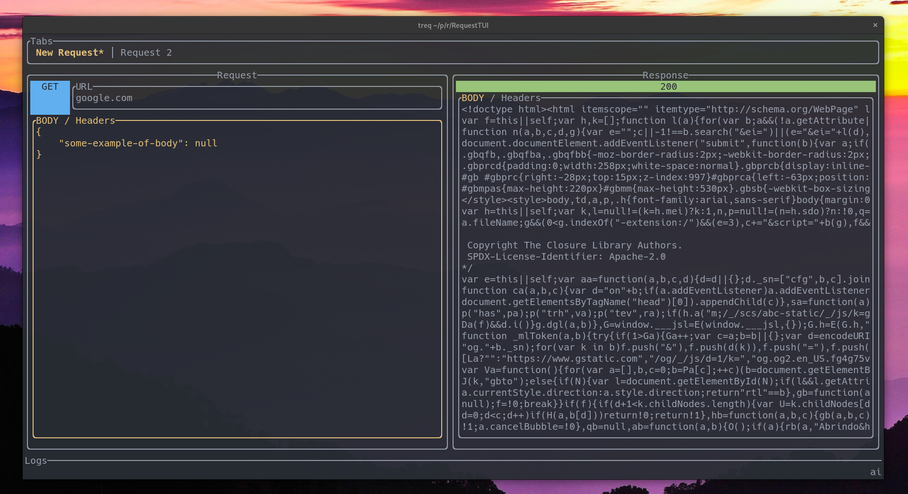

<p align="center">

</p>

# TReq 



# Instalation
For <b>Debian</b> users or variants (<b>Ubuntu, Linux Mint, PopOS</b>) is possible to download TReq using the [.deb file](https://github.com/talis-fb/TReq/releases/download/v0.1.1/treq_0.1.1_amd64.deb).

After download it by link [HERE](https://github.com/talis-fb/TReq/releases/download/v0.1.1/treq_0.1.1_amd64.deb) you can just run the command below pointing to file.
```sh
$ sudo dpkg -i path_to_file.deb
```

<br>

For <b>Arch Linux</b> or <b>Manjaro</b> users is possible download TReq using [AUR](https://aur.archlinux.org/).
```sh
$ git clone https://aur.archlinux.org/treq.git
$ cd treq
$ makepkg -si
```
Or, if you use the [yay](https://github.com/Jguer/yay) just run...
```sh
$ yay -S treq
```

<br>

For <b>anyone else</b>, you can also download TReq by [Crates.io](https://crates.io/) repository. Using this method requires to have [Rust](https://www.rust-lang.org/pt-BR/tools/install) installed.
```sh
cargo install treq
```
